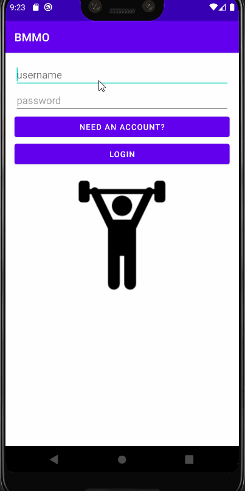

Original App Design Project - README Template
===


# BMMO Exercise
by Melissa, Dogukan, Daniel, Rabiul

## Table of Contents
1. [Overview](#Overview)
1. [Product Spec](#Product-Spec)
1. [Wireframes](#Wireframes)
2. [Schema](#Schema)

## Overview
### Description
An excersing app that utilizes elements of role playing where the more the user workouts the futher they can upgrade their characters stats.

### App Evaluation
[Evaluation of your app across the following attributes]
- **Category: Health**
- **Mobile: Yes**
- **Story: Cool**
- **Market: Health**
- **Habit: everyday workout**
- **Scope: small**

## Product Spec

### 1. User Stories (Required and Optional)

**Required Must-have Stories**

- [X]  character/Profile
- [X] stats
  * level
  * stamina
  * health
  * strength
  * BMI (height and weight)
  * mana
- [X] login - logout


**Optional Nice-to-have Stories**

* [X] register
* get cards (badges)
* Quote of the day
* missing two days will make u lose experience.
* music
* Intelligence (default quiz)


### 2. Screen Archetypes

- [X]  Login Screen
   * User can login.
- [X]  Register/Character creation screen
    * register
- [X]  Profile Screen
   * User can view their stats.
- [X]  Exercise screen
    * boxes with workouts
    * once clicked, decide on time or total youre going for

### 3. Navigation

**Tab Navigation** (Tab to Screen)

* Main Screen (feed of everything they have been doing)
* Exercise
* Profile

**Flow Navigation** (Screen to Screen)

* Login Screen
    * Main Screen or profile
    * Register
* Register
    * Character creation
* Character Creation Screen
    * Profile
* Exercise Screen
    * Exercises

## Wireframes
[Hand sketched wireframes]


[NEW Prototype Home Screen Wireframe] - Rabiul


Wirefram created with [Figma]

## Video Walkthrough
https://www.youtube.com/watch?v=3DdENjV4zSU

Here's a walkthrough of implemented user stories:



GIF created with [LiceCap](http://www.cockos.com/licecap/).

### [BONUS] Digital Wireframes & Mockups
https://www.figma.com/file/2hpgyGy9dig2V9noWDtYfU/Untitled?node-id=0%3A1
### [BONUS] Interactive Prototype

## Schema 
[This section will be completed in Unit 9]
### Models

Profile
| Property | Type    | Description             |
| -------- | ------- | ----------------------- |
| userID   | string  | Unique id for character |
| Stats    | array   | Array containing stats  |
| workout  | pointer | data from workouts      |
| BMI      | float   | BMI                     |
| Name     | String  | name of profile         |

Workout

| Property   | Type   | Description          |
| ---------- | ------ | -------------------- |
| Name       | String | Name of the Exercise |
| experience | double | Exp to level up      |
| time       | double | time to complete     |

Quiz

| Property   | Type   | Description      |
| ---------- | ------ | ---------------- |
| Name       | String | Name of the Quiz |
| Question   | String | Question         |
| experience | double | Exp to level up  |
| Answer     | String | Answer           |


### Networking
 - Profile Screen
    - (Read/GET) Query logged in user object
    - (Update/PUT) Update user profile 
    - (Read/GET) Get stats
    - (Update/PUT) Update stats

- Login Screen
    - (Read/GET) id
    - (Read/GET) Query logged in user object

- Register /Character creation screen
    - (Read/GET) Query logged in user object
    - (Update/PUT) Update user profile

- Workout
    - (Update/PUT) Experience / stats
    - (Update/PUT) Update user profile

- Quiz
    - (Read/GET) Answer
    - (Update/PUT) Update the score
    - (Update/PUT) Experience for int
 
```JAVA
ParseQuery<Profile> query = ParseQuery.getQuery(Profile.class);
        query.include(Profile.KEY_USER);
        query.whereEqualTo(Profile.KEY_USER, ParseUser.getCurrentUser());
        query.setLimit(20);
        query.addDescendingOrder(Profile.KEY_CREATED_AT);
        query.findInBackground(new FindCallback<Profile>() {
            @Override
            public void done(List<Workout> workouts, ParseException e) {
                if (e != null) {
                    Log.e(TAG, "Issue with getting workout", e);
                    return;
                }
                for (Workout workout : workout) {
                    Log.i(TAG, "Workout: " + workout.getExercise() + ", User: "
                            + workout.getUser().getUsername());
                }
                allWorkout.addAll(workout);
                adapter.notifyDataSetChanged();
```
